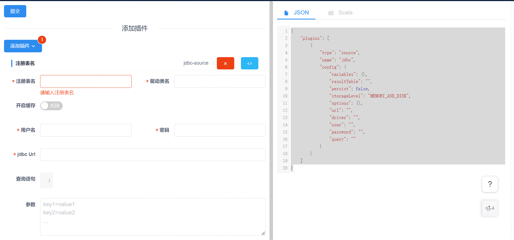

# BML2Linkis 工作流节点类型开发指南

> 本文主要介绍 BML2Linkis 工作流节点类型，以及如何开发一个 BML2Linkis 工作流节点。

## 一、什么是 BML2Linkis 工作流节点类型

很多时候，我们希望降低用户写代码的学习成本，因此想设计一个UI界面，让用户只需在表单UI中简单输入几个参数，就为用户自动生成相关代码。

因此，这种使用场景催生了 BML2Linkis 工作流节点类型。

例如，SparkETL 工作流节点就是一种典型的 BML2Linkis 工作流节点类型。用户只需在UI界面的左侧配置 source、sql-transformation 和 sink 等三种插件，
右侧就会自动为用户生成复杂的 JSON 代码或 Scala 代码，该代码一经生成，可直接提交给 Linkis Spark 引擎进行执行。



## 二、为什么需要 BML2Linkis 工作流节点类型

BML2Linkis 是 AppConn 的一种特殊实现，之所以单独作为一种节点类型，是因为 BML2Linkis 有独立的前端 UI 界面，前端甚至与后台可能还存在交互逻辑。

所不同的地方在于，BML2Linkis 的目标非常单一，主要是为了降低代码编写门槛，为用户生成可被 Linkis 某个引擎直接执行的一段代码。

而其他的第三方外部 AppConn 一般都是一个独立的系统，有完整的系统能力，DSS 只是集成了该第三方系统的一部分能力。

因此，BML2Linkis 是一种特殊的 AppConn，它与普通的 AppConn 相比，最大的不同是执行功能完全交给了 Linkis，即我们无需考虑 `OnlyDevelopmentAppConn` 的 ```RefExecutionService```。

## 三、如何实现一个 BML2Linkis 工作流节点

请注意，完成 [第三方系统接入DSS开发指南](第三方系统接入DSS开发指南.md) 是本步骤开始的前提。

您需先熟读并完成 [DSS工作流如何新增工作流节点](DSS工作流如何新增工作流节点.md) 要求的步骤之后，再按本步骤完成相关的开发。

从用户在工作流 DAG 画布上拖出一个新的 BML2Linkis 工作流节点开始，整个前后台交互流程如下：

用户拖出&创建新的 BML2Linkis 工作流节点 -> 用户双击打开该工作流节点 -> DSS 前端调用 `getAppConnNodeUrl` 接口获取该工作流节点的 URL
-> **(1)DSS 后台 调用该 AppConn 的 `RefQueryJumpUrlOperation` 获取 `jumpURL`** -> **(2)DSS 前端通过 Iframe 打开 `jumpURL`** ->
用户在该节点的 UI 界面编辑内容 -> **(3)用户点击保存时，该节点的 UI 界面先生成代码，并通过调用 Linkis 的 `将脚本保存到BML` 接口，将代码保存到 BML** ->
**(4)获取到 BML 返回的文件信息 `resourceId` 和 `version`，通过前端 Iframe 通信将 BML 文件信息传递给 DSS 工作流** -> DSS 工作流将 BML 文件信息写入 DSS 工作流

#### (1) DSS 后台 调用该 AppConn 的 `RefQueryJumpUrlOperation` 获取 `jumpURL`

此步骤为后台实现，要求通过实现 AppConn 的 `RefQueryJumpUrlOperation` 接口，返回一个包含了 `jumpURL` 的 `QueryJumpUrlResponseRef`。

`jumpURL` 的格式要求为： `${url}?resourceId=${resouceId}&version=${version}&nodeId=${nodeId}&projectName=${projectName}`。

您也可以在 `jumpURL` 的 URL 中加更多您需要的参数，但是以上的参数是 DSS 架构所要求必须携带的。

以下是一段示例代码，用于返回一个满足 `jumpURL` 格式要求的 `QueryJumpUrlResponseRef`：

```java
import com.webank.wedatasphere.dss.standard.app.development.operation.AbstractDevelopmentOperation;
import com.webank.wedatasphere.dss.standard.app.development.operation.RefQueryJumpUrlOperation;
import com.webank.wedatasphere.dss.standard.app.development.ref.QueryJumpUrlResponseRef;
import com.webank.wedatasphere.dss.standard.app.development.ref.impl.OnlyDevelopmentRequestRef;
import com.webank.wedatasphere.dss.standard.app.development.utils.QueryJumpUrlConstant;
import com.webank.wedatasphere.dss.standard.common.exception.operation.ExternalOperationFailedException;
import org.apache.commons.lang3.StringUtils;

public class TestRefQueryJumpUrlOperation extends AbstractDevelopmentOperation<OnlyDevelopmentRequestRef.QueryJumpUrlRequestRefImpl, QueryJumpUrlResponseRef>
        implements RefQueryJumpUrlOperation<OnlyDevelopmentRequestRef.QueryJumpUrlRequestRefImpl, QueryJumpUrlResponseRef> {

    @Override
    public QueryJumpUrlResponseRef query(OnlyDevelopmentRequestRef.QueryJumpUrlRequestRefImpl requestRef) throws ExternalOperationFailedException {
        // myTest 为前端页面的实际 URI，请按照实际情况进行指定
        String jumpUrl = mergeBaseUrl("#/myTest?resourceId=%s&version=%s&%s=%s&%s=%s");
        String resourceId = (String) requestRef.getRefJobContent().get("resourceId");
        String version = (String) requestRef.getRefJobContent().get("version");
        if(StringUtils.isBlank(resourceId) || StringUtils.isBlank(version)) {
              logger.info("resourceId or version is empty, maybe user {} want to create a new node.", requestRef.getUserName());
              resourceId = "";
              version = "";
        }
        jumpUrl = String.format(jumpUrl, resourceId, version, QueryJumpUrlConstant.NODE_ID.getKey(),
                QueryJumpUrlConstant.NODE_ID.getValue(), QueryJumpUrlConstant.PROJECT_NAME.getKey(), QueryJumpUrlConstant.PROJECT_NAME.getValue());
        return QueryJumpUrlResponseRef.newBuilder().setJumpUrl(jumpUrl).build();
    }

}
```

#### (2) DSS 前端通过 Iframe 打开 `jumpURL`

DSS 前端通过 Iframe 打开该 `jumpURL`，这时该第三方页面开始渲染 UI ，涉及两种场景，具体如下：
- 用户新建工作流节点，此时 `jumpURL` 的 `resourceId` 和 `version` 为空，这时只需渲染出该第三方页面的初始页面即可。
- 用户修改工作流节点，此时 `jumpURL` 的 `resourceId` 和 `version` 不为空，该第三方页面需先调用 Linkis `PublicService` 服务的 `打开BML的脚本`(见下文) 接口，
获取代码内容，并为用户填充 UI 表单的内容。

其中，`fileName` 的命名格式为：`${resourceId}.${engineType}.${runType}`。

#### (3) 用户点击保存时，该节点的 UI 界面先生成代码，并通过调用 Linkis 的 `将脚本保存到BML` 接口，将代码保存到 BML

可调用 Linkis `PublicService` 服务的接口，生成 `resourceId` 和 `version`，或更新代码的版本，具体为如下两个接口：

- [将脚本保存到BML](https://linkis.apache.org/zh-CN/docs/latest/api/http/linkis-ps-publicservice-api/bmlfs-management-api#%E4%BF%9D%E5%AD%98%E6%9D%A5%E8%87%AAbml%E7%9A%84script)
- [打开BML的脚本](https://linkis.apache.org/zh-CN/docs/latest/api/http/linkis-ps-publicservice-api/bmlfs-management-api#%E6%89%93%E5%BC%80scriptfrombml)

如果您的 BML2Linkis 节点所对应的第三方页面没有后台，可直接调如上的 `将脚本保存到BML` 接口，将生成的脚本直接保存到 BML。

#### (4) 获取到 BML 返回的文件信息 `resourceId` 和 `version`，通过前端 Iframe 通信将 BML 文件信息传递给 DSS 工作流

首先，我们需熟悉第三方系统的前端如何对接 DSS 工作流节点的前端。[点我参考第三方系统前端对接DSS前端](https://github.com/WeBankFinTech/DataSphereStudio-Doc/blob/main/zh_CN/%E5%BC%80%E5%8F%91%E6%96%87%E6%A1%A3/DSS%E5%B7%A5%E4%BD%9C%E6%B5%81%E5%A6%82%E4%BD%95%E6%96%B0%E5%A2%9E%E5%B7%A5%E4%BD%9C%E6%B5%81%E8%8A%82%E7%82%B9.md#12-%E7%AC%AC%E4%B8%89%E6%96%B9%E8%8A%82%E7%82%B9%E7%B1%BB%E5%9E%8B%E7%9A%84%E7%89%B9%E6%AE%8A%E5%AF%B9%E6%8E%A5)

BML2Linkis 都是 `先打开，后创建` 这种类型。因此要求 BML2Linkis 的 UI 页面必须通过父子 Iframe 进行通信。

如果您不清楚 DSS 前端与第三方页面的父子 Iframe 如何通信，请在开发前详细阅读 [第三方系统前端对接DSS前端](https://github.com/WeBankFinTech/DataSphereStudio-Doc/blob/main/zh_CN/%E5%BC%80%E5%8F%91%E6%96%87%E6%A1%A3/DSS%E5%B7%A5%E4%BD%9C%E6%B5%81%E5%A6%82%E4%BD%95%E6%96%B0%E5%A2%9E%E5%B7%A5%E4%BD%9C%E6%B5%81%E8%8A%82%E7%82%B9.md#12-%E7%AC%AC%E4%B8%89%E6%96%B9%E8%8A%82%E7%82%B9%E7%B1%BB%E5%9E%8B%E7%9A%84%E7%89%B9%E6%AE%8A%E5%AF%B9%E6%8E%A5)。

因此，我们知道了 ```postMessage``` 传递的字符串格式为：

```json
{
  "type": "第三方 AppConn 类型，如：visualis",
  "nodeId": "DSS 工作流的 node key",
  "data": {
    "action": "add 或 delete，指事件类型为新增或删除",
    "jobContent": {
      // DSS 工作流会将这个 map 放到 DSS 工作流节点的 jobContent 之中。
      // 以下是一个示例
      "resourceId": "SJJKKNKNOIJI23rXX",
      "version": "000001",
      "fileName": "SJJKKNKNOIJI23rXX.spark.sparketl"
    }
  }
}
```

如上所示，我们要求 `jobContent` 的内容必须包含如下三个字段：
- `resourceId` 和 `version` ，是 BML 文件的 `resourceId` 和 `version`。要求该 UI 界面生成的代码需保存到 Linkis 的 BML 之中。
- `fileName`，命名格式为：${resourceId}.${engineType}.${runType}。